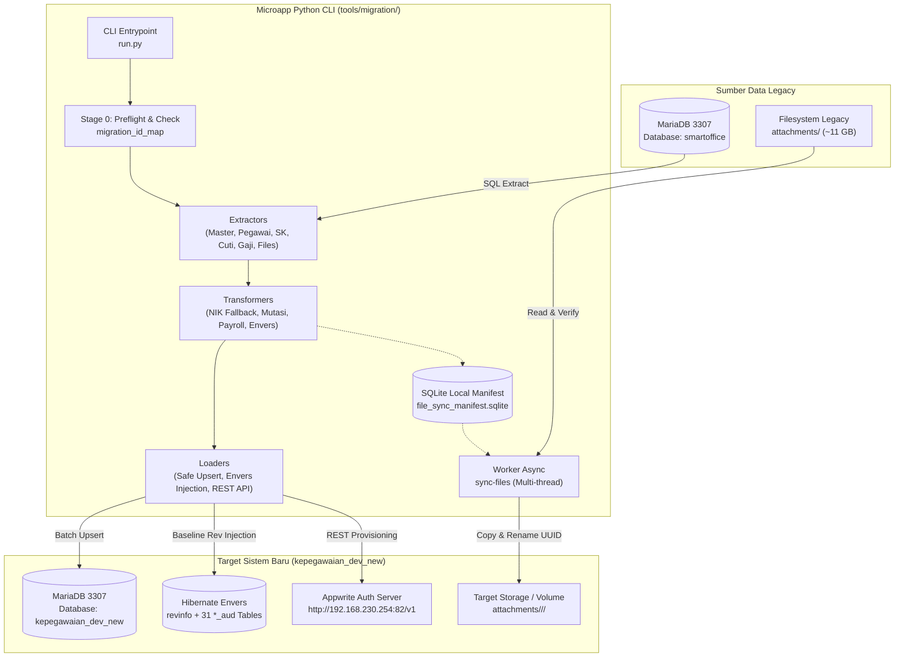
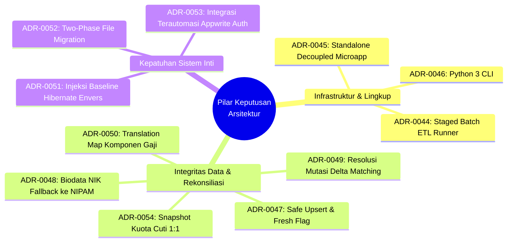
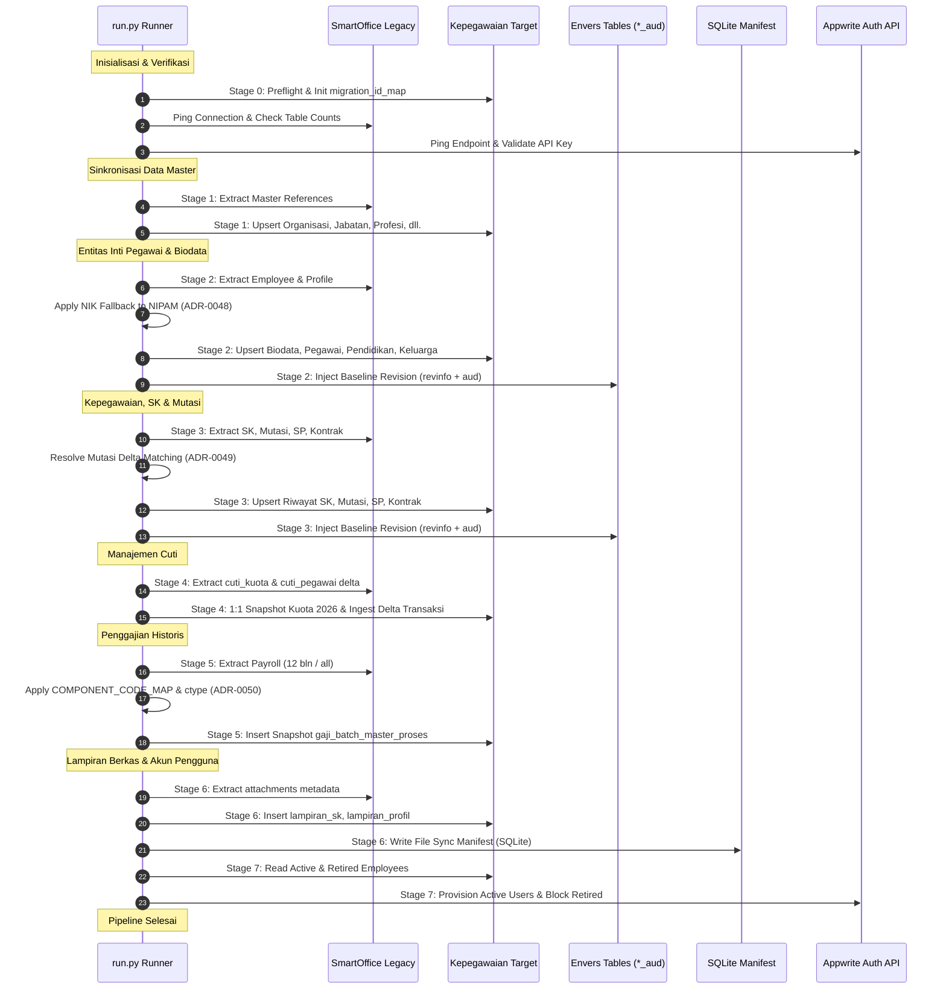
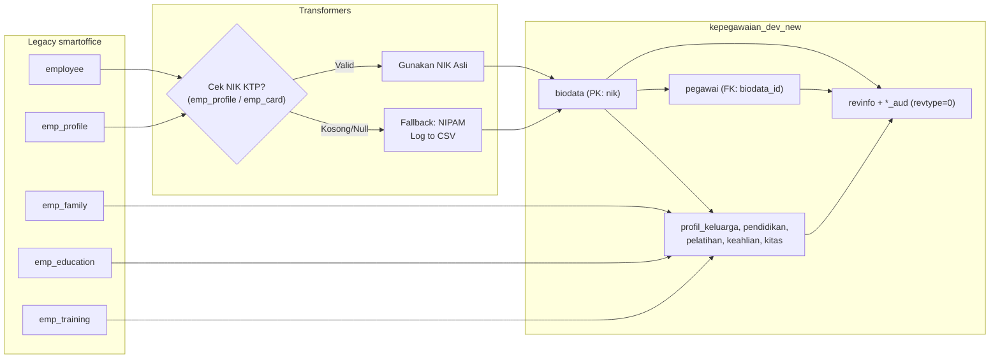
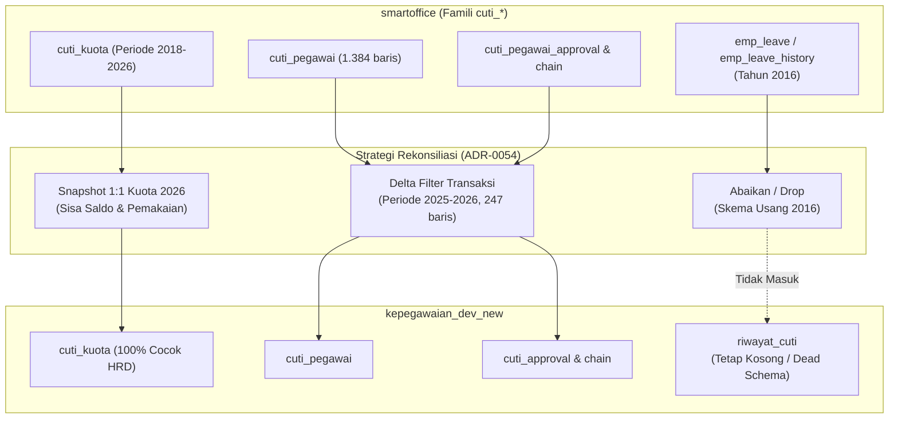
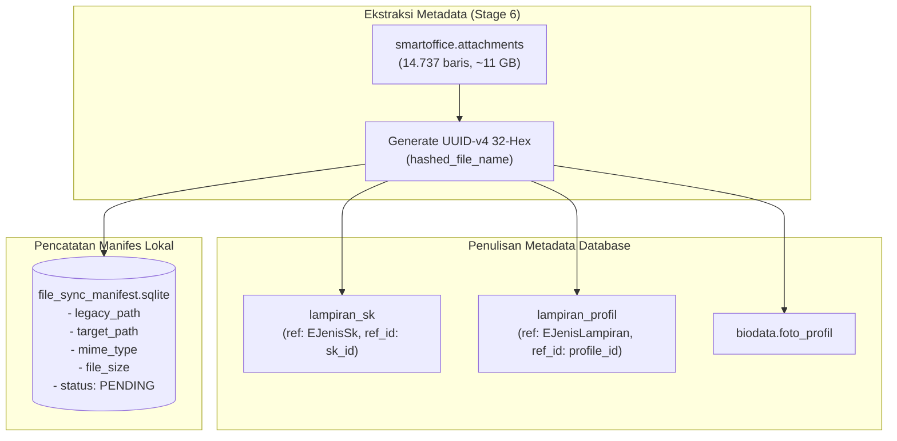
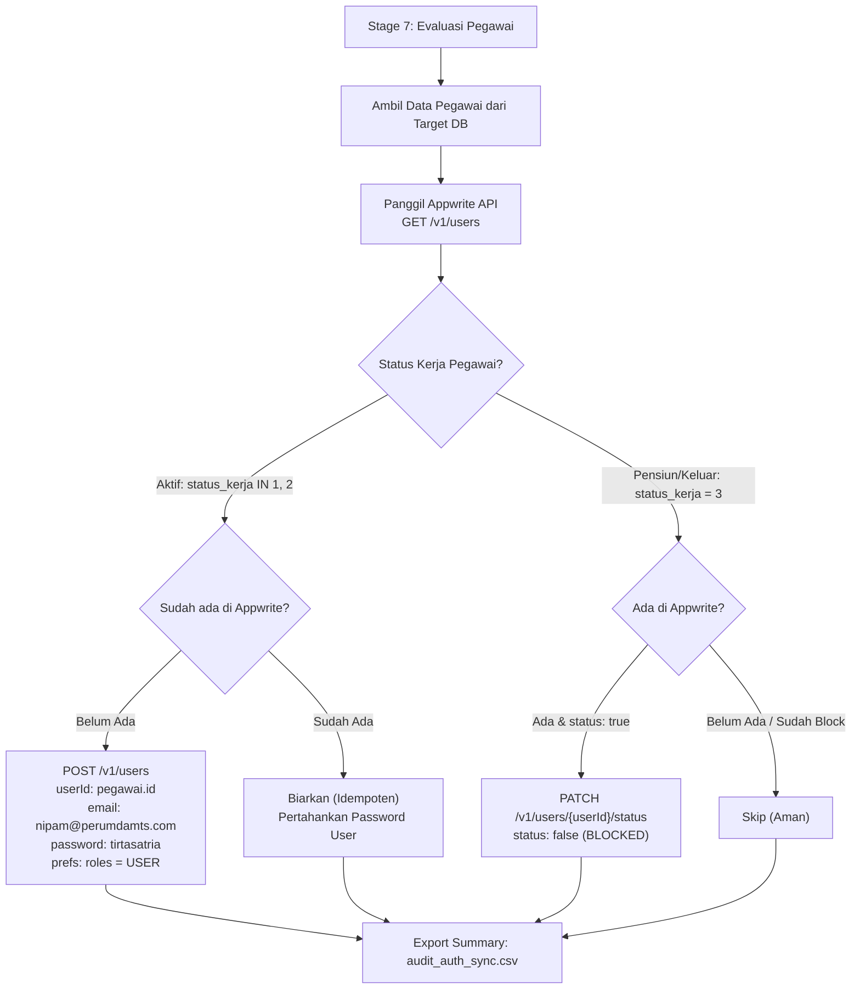
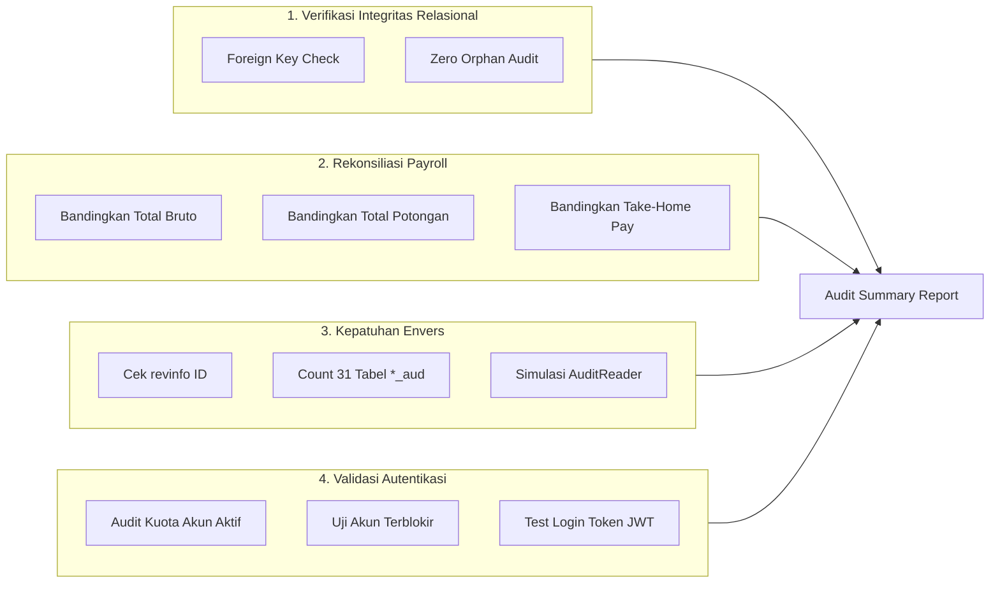

# Spesifikasi Arsitektur: Microapp Migrasi Data Legacy SmartOffice ke Kepegawaian Baru

Dokumen ini merupakan spesifikasi arsitektur komprehensif untuk perkakas migrasi data (ETL Batch Runner) yang memindahkan, menyelaraskan, dan memvalidasi data kepegawaian dari sistem legacy monolitik **SmartOffice** ke sistem baru **Kepegawaian** (`kepegawaian_dev_new`). Spesifikasi ini merangkum seluruh konsensus arsitektur hasil sesi wawancara Grilling dan keputusan arsitektur resmi ([ADR-0044](adr/0044-staged-batch-etl-runner-migrasi-legacy.md) s/d [ADR-0054](adr/0054-rekonsiliasi-snapshot-kuota-cuti-dan-delta-transaksi.md)).

---

## 1. Ringkasan Eksekutif & Tujuan

### 1.1 Latar Belakang & Permasalahan

Sistem informasi manajemen kepegawaian eksisting PERUMDAM Tirta Satria sebelumnya tergabung dalam aplikasi monolitik **SmartOffice**. Database legacy `smartoffice` menggabungkan modul persuratan berukuran jutaan baris dengan data kepegawaian, profil pegawai, cuti, absensi, dan penggajian.

Dalam proses pengembangan sistem baru berbasis Java 25 & Spring Boot 4 (`kepegawaian_dev_new`), database baru telah dibuat dengan skema terefaktor dan normalisasi ketat (termasuk audit trail Hibernate Envers dan autentikasi terpusat via Appwrite Auth). Namun, ditemukan sejumlah diskrepansi dan gap data riil yang belum termigrasi lengkap dari database legacy, antara lain:
- Sebanyak 228 data Surat Peringatan (`riwayat_sp`) dan data kontrak kerja belum termigrasi.
- Sebanyak 247 baris transaksi cuti operasional (`cuti_pegawai` periode 2025–2026) dan pembaruan sisa kuota cuti tahun berjalan belum sinkron.
- Data profil keluarga, pendidikan, dan pelatihan berisiko hilang (orphan) karena ketiadaan NIK KTP pada profil pegawai legacy.
- Inkonsistensi data mutasi jabatan vs unit kerja yang dicatat dalam form mutasi gabungan legacy.
- Beban transfer berkas lampiran fisik sebesar ~10,98 GB (14.737 berkas) yang jika disalin langsung akan memblokir database.
- Ketiadaan rekam jejak audit awal pada 31 tabel audit Hibernate Envers (`*_aud`), yang menyebabkan workflow pengajuan profil pegawai melempar `RevisionDoesNotExistException`.
- Pegawai aktif hasil migrasi tidak dapat login ke aplikasi baru karena belum terdaftar di Appwrite Auth.

### 1.2 Tujuan Utama

1. **Akurasi & Integritas Data Riil 100%**: Memastikan aplikasi baru dapat diuji dan dijalankan di lingkungan development, staging, dan production dengan data operasional riil yang lengkap, konsisten, dan bebas dari data orphan.
2. **Idempotensi & Keamanan Eksekusi**: Runner migrasi dapat dieksekusi berulang kali (*re-entrant*) tanpa menduplikasi data atau merusak data yang telah disesuaikan di lingkungan target.
3. **Zero Production Bloat**: Menjaga codebase aplikasi utama Spring Boot tetap bersih, ramping, dan bebas dari dependensi, entity temporary, atau logika kotor database legacy.
4. **Resolusi Transisi Satu Pintu (Cutover Tool)**: Menyediakan alur migrasi terstruktur yang siap dipakai untuk migrasi data development berulang kali, serta menjadi instrumen resmi saat hari pemindahan (*cutover day*) di production.

---

## 2. Arsitektur & Topologi Tool

### 2.1 Diagram Arsitektur Sistem



### 2.2 Lingkungan & Konektivitas

| Komponen | Host / URL | Port | Database / Namespace | Keterangan |
| :--- | :--- | :--- | :--- | :--- |
| **Database Sumber (Legacy)** | `192.168.230.84` | `3307` | `smartoffice` | Database monolitik sumber migrasi. Akses Read-Only. |
| **Database Target (Baru)** | `192.168.230.84` | `3307` | `kepegawaian_dev_new` | Database target aplikasi baru (MariaDB 11.x). |
| **Layanan Autentikasi** | `http://192.168.230.254:82/v1` | `82` | Project: `kepegawaian` | REST API Appwrite Server untuk provisioning akun. |
| **Penyimpanan Berkas Legacy** | `/path/to/legacy/attachments/` | - | Local / NFS | Direktori fisik berkas lampiran legacy (~10,98 GB). |
| **Penyimpanan Berkas Baru** | `/path/to/target/attachments/` | - | Local / Docker Volume | Direktori target berstruktur `<JENIS>/<refId>/<UUID>`. |

### 2.3 Struktur Direktori `tools/migration/`

Tool migrasi dibangun sebagai modul mandiri yang terisolasi di dalam direktori `tools/migration/`:

```
tools/migration/
├── run.py                          # CLI entrypoint runner & sub-command dispatcher
├── requirements.txt                # Dependensi Python minimal & ringan
├── pyproject.toml                  # Konfigurasi package & tool settings
├── README.md                       # Panduan instalasi dan penggunaan cepat
├── config/
│   ├── __init__.py
│   ├── settings.py                 # Load environment variables (.env) & default configs
│   ├── database.py                 # Pool koneksi MariaDB (source & target)
│   └── mapping_constants.py        # Kamus terpusat (COMPONENT_CODE_MAP, enum definitions)
├── extractors/
│   ├── __init__.py
│   ├── base_extractor.py           # Kelas abstrak extractor dengan generator/batch cursor
│   ├── master_extractor.py         # Ekstraksi tabel master referensi
│   ├── pegawai_extractor.py        # Ekstraksi employee, biodata, dan profil personal
│   ├── kepegawaian_extractor.py    # Ekstraksi riwayat SK, mutasi, SP, dan kontrak
│   ├── cuti_extractor.py           # Ekstraksi saldo cuti_kuota & delta transaksi cuti_pegawai
│   ├── penggajian_extractor.py     # Ekstraksi salary_process & detail komponen gaji
│   └── lampiran_extractor.py       # Ekstraksi metadata lampiran berkas fisik
├── transformers/
│   ├── __init__.py
│   ├── base_transformer.py         # Interface transformer data
│   ├── nik_resolver.py             # Resolusi NIK fallback ke NIPAM + export audit CSV
│   ├── mutasi_matcher.py           # Delta matching mutasi (MUTASI_LOKER vs MUTASI_JABATAN)
│   ├── payroll_transformer.py      # Normalisasi ctype (+/-), COMPONENT_CODE_MAP, snapshot
│   ├── cuti_reconciler.py          # Rekonsiliasi kuota 1:1 & pembersihan dead schema
│   ├── envers_baseline.py          # Generator revinfo & snapshot 31 tabel audit (revtype=0)
│   └── lampiran_hasher.py          # UUID-v4 32-hex generator & path translation
├── loaders/
│   ├── __init__.py
│   ├── base_loader.py              # Logika safe reconciliation upsert & batch executer
│   ├── mariadb_loader.py           # Eksekusi batch SQL (INSERT ... ON DUPLICATE KEY UPDATE)
│   ├── envers_loader.py            # Injeksi atomik ke revinfo dan tabel *_aud
│   ├── manifest_loader.py          # Writer ke SQLite file_sync_manifest.sqlite
│   └── appwrite_loader.py          # Client REST API Appwrite (Users API)
└── utils/
    ├── __init__.py
    ├── logger.py                   # Structured console logger & audit file exporter
    ├── state_tracker.py            # Pengelola tabel migration_id_map
    ├── preflight.py                # Pemeriksaan konektivitas & verifikasi prasyarat
    └── audit_exporter.py           # Generator berkas CSV untuk audit anomali data
```

### 2.4 Dependensi Pustaka Python

Tool sengaja menggunakan dependensi standar yang sangat ramping dan stabil:
- **`pymysql`** atau **`mariadb`**: Driver konektivitas native MariaDB berkecepatan tinggi dengan dukungan prepared statement dan parameter binding aman.
- **`pydantic`** / **`dataclasses`**: Pemodelan struktur record target, penegakan tipe data, dan validasi enum Java secara independen.
- **`requests`**: Klien HTTP REST untuk interaksi dengan Appwrite Server API (`/v1/users`).
- **`sqlite3`**: Pustaka bawaan standard library Python untuk penyimpanan lokal `file_sync_manifest.sqlite`.
- **`python-dotenv`**: Pemuatan konfigurasi fleksibel dari file `.env`.

### 2.5 Spesifikasi Antarmuka CLI

Runner utama dijalankan melalui `python run.py [COMMAND] [OPTIONS]`:

```bash
# Eksekusi pipeline migrasi utama
python run.py migrate [OPTIONS]

# Pengecekan koneksi & pra-kondisi (preflight)
python run.py check

# Sinkronisasi berkas fisik (Fase 2)
python run.py sync-files [OPTIONS]

# Sinkronisasi akun Appwrite Auth
python run.py sync-auth [OPTIONS]

# Verifikasi integritas & audit rekonsiliasi pasca migrasi
python run.py verify [OPTIONS]
```

#### Opsi & Flag CLI (`migrate`)

| Flag | Nilai | Default | Deskripsi |
| :--- | :--- | :--- | :--- |
| `--stage` | `0` s/d `7`, atau `all` | `all` | Menentukan tahapan pipeline migrasi spesifik yang ingin dijalankan. |
| `--domain` | `master`, `pegawai`, `kepegawaian`, `cuti`, `penggajian`, `lampiran`, `auth` | `all` | Membatasi migrasi hanya pada domain tertentu. |
| `--fresh` | *Boolean Flag* | `False` | **Khusus Lingkungan Dev**: Melakukan truncate bersih pada tabel domain target sebelum eksekusi. |
| `--payroll-all` | *Boolean Flag* | `False` | Memigrasikan seluruh riwayat payroll historis legacy (default: dibatasi 12 bulan terakhir). |
| `--dry-run` | *Boolean Flag* | `False` | Menjalankan seluruh proses ekstraksi dan transformasi tanpa menulis ke MariaDB/Appwrite. |
| `--limit` | *Integer (N)* | `None` | Membatasi jumlah record yang diproses per batch untuk sanity check cepat. |

---

## 3. Pilar Keputusan Arsitektur (11 ADR)

Spesifikasi microapp migrasi ini berdiri di atas 11 keputusan arsitektur (ADR-0044 s/d ADR-0054) yang telah disepakati:



### ADR-0044: Staged Batch ETL Runner untuk Migrasi Data
- **Keputusan**: Migrasi dijalankan menggunakan runner batch bertahap independen, bukan sinkronisasi real-time (CDC / Debezium) maupun endpoint HTTP.
- **Rasional**: Fokus migrasi adalah *cutover* transisi data eksisting secara aman, deterministik, dan dapat diulang (*idempotent*). Menghindari kompleksitas pemeliharaan replication pipeline jangka panjang untuk task yang hakikatnya sementara.
- **Dampak**: Memerlukan tabel pelacak state pemetaan (`migration_id_map`).

### ADR-0045: Standalone Migration Microapp Decoupled dari Core Backend
- **Keputusan**: Tool migrasi diisolasi secara fisik di direktori `tools/migration/`, terpisah dari aplikasi Spring Boot Java 25.
- **Rasional**: Mencegah penambahan ukuran JAR (*artifact bloat*), melindungi environment production dari kebocoran konfigurasi database legacy, dan menghilangkan risiko eksekusi runner yang tidak sengaja pada runtime API utama.

### ADR-0046: Python 3 CLI untuk Tooling Migrasi
- **Keputusan**: Menggunakan Python 3 CLI alih-alih Java Batch atau skrip SQL prosedural.
- **Rasional**: Mengeliminasi waktu kompilasi ulang (Gradle build overhead), memberikan fleksibilitas manipulasi string dan anomali format data kotor, serta memudahkan eksekusi terisolasi via perintah shell Linux.

### ADR-0047: Safe Reconciliation & Upsert sebagai Strategi Default
- **Keputusan**: Runner menerapkan pendekatan pencocokan record (*natural key matching* & hash) dengan aksi insert data baru dan update field kosong secara aman. Disediakan flag `--fresh` eksplisit untuk skenario reset kanvas kosong di development.
- **Rasional**: Database target `kepegawaian_dev_new` sudah memiliki data dasar (570 pegawai, 497 biodata). Truncate sepihak berisiko menghapus data uji baru, sedangkan mode append-only membiarkan data lama tetap memiliki field NULL.

### ADR-0048: Fallback NIK Biodata ke NIPAM untuk Profil Tanpa KTP Valid
- **Keputusan**: Jika data NIK KTP pada `emp_profile` atau `emp_card` legacy kosong atau tidak valid, runner otomatis menggunakan NIPAM pegawai (`employee.emp_code`) sebagai kunci primer `biodata.nik` sementara, mencatat pemetaan ke `migration_id_map`, dan mengekspor daftar anomali ke `audit_unresolved_nik.csv`.
- **Rasional**: Entitas `biodata` mewajibkan `nik` sebagai Primary Key dan menjadi induk Foreign Key bagi seluruh relasi anak (`pendidikan`, `profil_keluarga`, `pelatihan`, `keahlian`). Melewati (skip) record profil tanpa NIK KTP akan menyebabkan seluruh riwayat keluarga dan pendidikan milik pegawai bersangkutan hilang.

### ADR-0049: Resolusi Mutasi Unit Kerja dan Jabatan via Delta Matching
- **Keputusan**: Mengklasifikasikan data historis `emp_work_history` legacy ke dalam enum `EJenisMutasi` dengan aturan delta:
  1. Hanya unit kerja (`org_id`) berubah $\to$ `MUTASI_LOKER`.
  2. Hanya jabatan (`pos_id`) berubah $\to$ `MUTASI_JABATAN`.
  3. Keduanya berubah bersamaan $\to$ diprioritaskan sebagai `MUTASI_LOKER` (sesuai preferensi tim HR bahwa mutasi identik dengan pindah unit/loker), dengan tetap menyimpan snapshot jabatan baru pada record yang sama.
  4. Relasi Foreign Key ke `riwayat_sk` dihubungkan melalui nomor SK (`ewh_sk_no`).
- **Rasional**: Menghindari pemecahan satu kejadian mutasi menjadi dua baris terpisah (yang akan menduplikasi SK) dan menjaga akurasi laporan mutasi.

### ADR-0050: Rekonsiliasi Gap Komponen Gaji via Translation Map & Passthrough
- **Keputusan**: Migrasi rincian gaji historis (`salary_process_detail` $\to$ `gaji_batch_master_proses`) menerapkan:
  1. Konversi simbol `ctype`: `'+'` $\to$ `PEMASUKAN`, `'-'` $\to$ `POTONGAN`, lainnya $\to$ `NONE`.
  2. Standarisasi kode via kamus terpusat `COMPONENT_CODE_MAP`.
  3. Passthrough aman: Komponen insidental/ad-hoc lama tetap dimasukkan apa adanya tanpa Foreign Key ke master `gaji_komponen`.
- **Rasional**: Tabel `gaji_batch_master_proses` berkarakteristik snapshot historis. Memaksakan Foreign Key ke master baru akan menghilangkan baris potongan ad-hoc usang, yang berakibat rusaknya keseimbangan total penerimaan kotor, potongan, dan *take-home pay* bersih dibanding slip fisik lama.

### ADR-0051: Injeksi Baseline Revision Global Hibernate Envers
- **Keputusan**: Runner migrasi secara langsung menulis satu entri revisi resmi ke tabel `revinfo` dan menyisipkan baris snapshot awal ke 31 tabel `*_aud` (`revtype = 0` / `ADD`) untuk setiap entitas beranotasi `@Audited` yang dimigrasikan.
- **Rasional**: Penulisan langsung via SQL di luar JPA container tidak memicu listener Hibernate Envers. Jika tabel audit dibiarkan kosong, workflow pengajuan perubahan profil pegawai (`ProfileUpdateStrategy`, `RevInfoService`) akan gagal total akibat `RevisionDoesNotExistException`.

### ADR-0052: Two-Phase Migration untuk Berkas Fisik dan Metadata Lampiran
- **Keputusan**: Migrasi lampiran dipisah menjadi dua fase:
  - **Fase 1 (In-Pipeline ETL)**: Ekstraksi metadata, generate UUID-v4 32-hex (`hashed_file_name`), penulisan record ke `lampiran_sk`/`lampiran_profil`, dan pencatatan rencana pemindahan file ke SQLite `file_sync_manifest.sqlite`.
  - **Fase 2 (Worker Async Mandiri)**: Perintah `python run.py sync-files` menyalin dan me-rename fisik berkas sebesar ~10,98 GB secara *multithreaded*, *resumable*, dan berkecepatan tinggi tanpa memblokir migrasi database.
- **Rasional**: Memisahkan beban I/O disk 11 GB dari transaksi database inti. Memungkinkan pengujian fungsionalitas database di development selesai dalam hitungan menit tanpa harus mendownload seluruh berkas fisik.

### ADR-0053: Sinkronisasi Terautomasi Akun Appwrite Auth & Lifecycle User
- **Keputusan**: Runner menyediakan modul sinkronisasi terautomasi ke Appwrite REST API:
  1. Pegawai aktif (`status_kerja = 1` atau `2`) yang belum punya akun dibuatkan akun dengan `userId = pegawai.id`, email `<nipam>@perumdamts.com`, password default `tirtasatria`, dan role `["USER"]`.
  2. Akun pegawai yang sudah ada dipertahankan tanpa me-reset password.
  3. Pegawai pensiun/berhenti (`status_kerja = 3`) yang akunnya ada di Appwrite diubah statusnya menjadi non-aktif / blocked (`status: false`) untuk menegakkan keamanan eks-pegawai ([ADR-0039](adr/0039-rbac-user-lifecycle-no-hard-delete.md)).
- **Rasional**: Frontend login langsung ke Appwrite. Ketiadaan akun membuat pegawai tidak bisa login sama sekali. Menonaktifkan akun pensiun mencegah akses ilegal pasca-cutover.

### ADR-0054: Rekonsiliasi Snapshot Kuota Cuti & Ingesti Delta Transaksi
- **Keputusan**: Menjadikan `smartoffice.cuti_kuota` sebagai kebenaran mutlak (snapshot 1:1) untuk saldo cuti tahun 2026, memigrasikan delta 247 baris transaksi aktif `cuti_pegawai` (beserta tabel approval dan detail), serta mengabaikan tabel usang 2016 (`emp_leave`, `emp_leave_history`) dan dead schema `riwayat_cuti`.
- **Rasional**: Perhitungan kuota cuti instansi memiliki siklus tahunan unik (1 Juli s/d 30 Juni tahun berikutnya) ditambah carry-over saldo dan penyesuaian khusus HRD. Menghitung ulang kuota dari nol murni dari tanggal transaksi akan menghasilkan deviasi angka saldo sisa cuti.

---

## 4. Urutan Tahapan Eksekusi Pipeline (Pipeline Stages)

Pipeline migrasi dirancang dalam 8 tahapan berurutan (*sequential stages*) yang mematuhi keterikatan referensial data:



---

### Stage 0: Preflight & Environment Check

Tahap pembuka untuk memverifikasi kesiapan seluruh subsistem sebelum data diproses.

1. **Connectivity Check**:
   - Memastikan koneksi ke database sumber (`smartoffice`) berstatus Read-Only dan stabil.
   - Memastikan koneksi ke database target (`kepegawaian_dev_new`) memiliki hak akses DDL/DML yang cukup.
   - Memverifikasi konektivitas ke Appwrite Server REST API dengan `APPWRITE_API_KEY` yang valid (scope: `users.read`, `users.write`).
2. **Inisialisasi Tabel State `migration_id_map`**:
   - Memeriksa keberadaan tabel pelacak ID di database target. Jika belum ada, runner membuat tabel berikut:
   ```sql
   CREATE TABLE IF NOT EXISTS `migration_id_map` (
       `legacy_table` VARCHAR(64) NOT NULL,
       `legacy_id` VARCHAR(64) NOT NULL,
       `new_table` VARCHAR(64) NOT NULL,
       `new_id` VARCHAR(64) NOT NULL,
       `record_hash` VARCHAR(64) DEFAULT NULL,
       `migrated_at` TIMESTAMP DEFAULT CURRENT_TIMESTAMP,
       PRIMARY KEY (`legacy_table`, `legacy_id`),
       KEY `idx_mig_new_ref` (`new_table`, `new_id`)
   ) ENGINE=InnoDB DEFAULT CHARSET=utf8mb4 COLLATE=utf8mb4_unicode_ci;
   ```
3. **Pemeriksaan Flag `--fresh`**:
   - Jika flag `--fresh` aktif, runner meminta konfirmasi interaktif (kecuali dipadukan dengan `--yes`) lalu melakukan truncate terkontrol pada tabel-tabel target yang relevan.

---

### Stage 1: Master Reference Sync

Menyelaraskan tabel-tabel referensi dasar agar seluruh entitas bisnis di tahapan berikutnya memiliki referensi Foreign Key yang valid.

- **Tabel Sumber**: `organization`, `position`, `master_religion`, `master_education`, `profesi`, dll.
- **Tabel Target**: `organisasi`, `jabatan`, `profesi`, `jenjang_pendidikan`, `jenis_keahlian`, `jenis_pelatihan`, `jenis_sp`, `sanksi_sp`, `alasan_berhenti`, `hari_libur`.
- **Aturan Transformasi**:
  - Normalisasi nama unit kerja dan kode jabatan.
  - Mempertahankan ID referensi numerik legacy bila memungkinkan, atau memetakannya ke `migration_id_map`.
  - Inisialisasi struktur hierarki organisasi (`org_group` dan `parent_id`).

---

### Stage 2: Pegawai & Biodata (Core Identity)

Memigrasikan identitas pegawai, profil biodata lengkap, dan seluruh sub-entitas personal anak.



1. **Resolusi NIK Fallback (ADR-0048)**:
   - Evaluasi NIK dari `emp_profile.emp_identity_number` dan `emp_card`.
   - Jika kosong, null, atau hanya karakter strip/spasi $\to$ gunakan `employee.emp_code` (NIPAM) sebagai nilai `biodata.nik`.
   - Simpan entri pemetaan: `('emp_profile', emp_profile_id) -> ('biodata', nik)` ke `migration_id_map`.
   - Catat anomali ke berkas `audit_unresolved_nik.csv` untuk rekonsiliasi tim HRD.
2. **Upsert Tabel Operasional**:
   - Insert/update `biodata` (nama, tempat/tgl lahir, jenis kelamin, agama, alamat, no telp).
   - Insert/update `pegawai` (nipam, status_kerja, tanggal_masuk, organisasi_id, jabatan_id, profesi_id).
   - Insert/update tabel anak: `profil_keluarga`, `pendidikan`, `pelatihan`, `keahlian`, `pengalaman_kerja`, `kartu_identitas`.
3. **Injeksi Baseline Revision Envers (ADR-0051)**:
   - Buat revisi baru di `revinfo`: `INSERT INTO revinfo (revtstmp) VALUES (<current_epoch_ms>)`.
   - Insert snapshot baris ke `biodata_aud`, `pegawai_aud`, `profil_keluarga_aud`, `pendidikan_aud`, `pelatihan_aud`, `keahlian_aud`, `pengalaman_kerja_aud`, `kartu_identitas_aud` dengan `revtype = 0` (`ADD`).

---

### Stage 3: Kepegawaian & SK (Career History)

Memigrasikan rekam jejak surat keputusan, mutasi, kontrak kerja, dan riwayat disiplin/sanksi pegawai.

1. **Riwayat SK (`riwayat_sk`)**:
   - Memigrasikan SK pengangkatan, berkala, kenaikan pangkat, pensiun, dll.
   - Mengisi kolom `jenis_sk` berbasis enum `EJenisSk`.
   - Memetakan relasi ke `pegawai_id`.
2. **Riwayat Mutasi via Delta Matching (ADR-0049)**:
   - Baca `emp_work_history` legacy.
   - Evaluasi perubahan organisasi (`org_id`) dan jabatan (`pos_id`):
     - Hanya `org_id` berubah $\to$ `EJenisMutasi.MUTASI_LOKER`.
     - Hanya `pos_id` berubah $\to$ `EJenisMutasi.MUTASI_JABATAN`.
     - Keduanya berubah $\to$ `EJenisMutasi.MUTASI_LOKER` (snapshot jabatan baru tetap tersimpan).
   - Hubungkan nomor SK (`ewh_sk_no`) ke record `riwayat_sk` terkait.
3. **Riwayat SP & Kontrak Kerja**:
   - Ingesti 228 data SP yang belum ada ke `riwayat_sp` (memetakan jenis SP, sanksi, tanggal berlaku).
   - Ingesti riwayat perpanjangan kontrak ke `riwayat_kontrak`.
4. **Injeksi Baseline Revision Envers**:
   - Catat revisi ke `revinfo`.
   - Insert snapshot ke `riwayat_sk_aud`, `riwayat_mutasi_aud`, `riwayat_sp_aud`, `riwayat_kontrak_aud` (`revtype = 0`).

---

### Stage 4: Transaksi & Kuota Cuti (Leave Management)

Menyelaraskan manajemen cuti dengan strategi rekonsiliasi snapshot kuota dan ekstraksi delta transaksi ([ADR-0054](adr/0054-rekonsiliasi-snapshot-kuota-cuti-dan-delta-transaksi.md)).



1. **Snapshot Rekonsiliasi Kuota 2026**:
   - Mengambil data saldo dari `smartoffice.cuti_kuota` khusus tahun berjalan 2026.
   - Upsert ke `kepegawaian_dev_new.cuti_kuota` untuk memperbarui sisa cuti, cuti bersama, dan cuti terpakai secara presisi.
   - Menyisipkan entri kuota 2026 bagi pegawai aktif baru yang belum terdaftar.
2. **Ingesti Delta Transaksi Cuti 2025–2026**:
   - Memfilter transaksi `cuti_pegawai` aktif terbaru (delta 247 baris).
   - Menghubungkan relasi ke `pegawai_id` dan `cuti_jenis_id`.
   - Memigrasikan data verifikasi berjenjang ke `cuti_approval`, `cuti_approval_chain`, dan rincian hari cuti ke `cuti_klaim_detail`.
3. **Pembersihan & Eliminasi Dead Schema**:
   - Mengabaikan total data usang tahun 2016 (`emp_leave`, `emp_leave_history`).
   - Tidak menulis ke tabel `riwayat_cuti` (dead schema artifact).

---

### Stage 5: Penggajian Historis (Payroll Processing)

Memigrasikan riwayat slip gaji pegawai dengan pendekatan snapshot komponen aman ([ADR-0050](adr/0050-rekonsiliasi-gap-komponen-gaji-via-translation-map.md)).

1. **Jendela Data (Windowing)**:
   - **Default**: Memproses data 12 bulan terakhir untuk performa optimal dan relevansi operasional langsung.
   - **Flag `--payroll-all`**: Jika diaktifkan, memproses seluruh tahun historis yang tersedia di legacy.
2. **Transformasi Master Batch**:
   - Migrasi header proses gaji ke `gaji_batch_root` dan `gaji_batch_master`.
3. **Normalisasi Komponen Gaji (`gaji_batch_master_proses`)**:
   - **Konversi Tipe (`ctype`)**:
     - `'+'` $\to$ `EJenisGaji.PEMASUKAN`
     - `'-'` $\to$ `EJenisGaji.POTONGAN`
     - Selain itu $\to$ `EJenisGaji.NONE`
   - **Penerapan `COMPONENT_CODE_MAP`**: Menyelaraskan kode komponen singkatan legacy ke kode kanonikal baru.
   - **Passthrough Snapshot Aman**: Komponen tunjangan/potongan insidental yang tidak ada di master baru tetap dipertahankan nama dan nilainya tanpa referensi Foreign Key kaku ke `gaji_komponen`.
4. **Verifikasi Nominal**:
   - Menghitung akumulasi penerimaan kotor (bruto), total potongan, dan take-home pay (netto) per pegawai untuk memastikan saldo seimbang 100% dengan arsip slip gaji fisik.

---

### Stage 6: Metadata Lampiran & File Sync Manifest

Menjalankan Fase 1 dari migrasi berkas lampiran ([ADR-0052](adr/0052-two-phase-file-attachment-migration.md)).



1. **Ekstraksi Metadata Lampiran**:
   - Membaca metadata dari tabel `smartoffice.attachments` (relasi polymorphic ke SK, profil, SP, dan foto).
2. **Generate Identitas Unik Target**:
   - Menghasilkan token UUID-v4 32 karakter hexadesimal tanpa tanda strip (`uuid4().hex`) sebagai `hashed_file_name`.
   - Menentukan target path dengan konvensi:
     `attachments/<JENIS_ENUM>/<ref_id>/<hashed_file_name>.<ext>`
3. **Insert Metadata ke Database Target**:
   - Menulis ke `lampiran_sk` (dengan `ref` bernilai `EJenisSk`).
   - Menulis ke `lampiran_profil` (dengan `ref` bernilai `EJenisLampiranProfil`).
   - Menulis field `foto_profil` pada `biodata`.
4. **Penyusunan Manifest Lokal (`file_sync_manifest.sqlite`)**:
   - Menulis detail pemindahan berkas ke SQLite lokal:
     ```sql
     CREATE TABLE IF NOT EXISTS file_manifest (
         id INTEGER PRIMARY KEY AUTOINCREMENT,
         legacy_path TEXT NOT NULL,
         target_path TEXT NOT NULL,
         hashed_name TEXT NOT NULL,
         mime_type TEXT,
         file_size INTEGER,
         status TEXT DEFAULT 'PENDING',  -- PENDING, COPIED, MISSING, ERROR
         error_message TEXT,
         synced_at TIMESTAMP
     );
     ```

---

### Stage 7: Appwrite Auth Provisioning

Menjalankan provisioning identitas pengguna terpusat ke Appwrite Auth Server ([ADR-0053](adr/0053-sinkronisasi-appwrite-auth-dan-lifecycle-user.md)).



1. **Audit & Query Pengguna Aktif**:
   - Mengambil seluruh pegawai dari tabel `pegawai` target.
   - Melakukan listing/lookup ke Appwrite Server via `GET /v1/users`.
2. **Provisioning Pegawai Aktif (`status_kerja = 1` atau `2`)**:
   - Jika akun belum ada di Appwrite:
     - `userId`: disamakan dengan ID integer pegawai (`str(pegawai.id)`).
     - `email`: `<nipam>@perumdamts.com`.
     - `name`: nama lengkap sesuai `biodata`.
     - `password`: default awal `"tirtasatria"`.
     - `preferences`: `{"roles": ["USER"]}`.
   - Jika akun sudah terdaftar: tidak menimpa password atau preferensi pengguna (idempoten).
3. **Lifecycle Block Pegawai Pensiun / Berhenti (`status_kerja = 3`)**:
   - Sesuai prinsip [ADR-0039](adr/0039-rbac-user-lifecycle-no-hard-delete.md): tidak melakukan *hard delete*.
   - Jika akun ditemukan dalam status aktif (`status: true`): panggil `PATCH /v1/users/{userId}/status` dengan payload `{"status": false}` untuk menonaktifkan akun.
4. **Pencatatan Audit**:
   - Menyimpan hasil sinkronisasi akun ke berkas log `audit_auth_sync.csv`.

---

### Worker Mandiri: Physical File Copy Worker (`sync-files`)

Menjalankan Fase 2 dari migrasi berkas lampiran ([ADR-0052](adr/0052-two-phase-file-attachment-migration.md)).

```bash
python run.py sync-files \
    --source /path/to/legacy/attachments \
    --target /path/to/target/attachments \
    --concurrency 8 \
    --checksum
```

- **Karakteristik Worker**:
  - Berjalan mandiri dan terpisah dari transaksi database.
  - Membaca record berstatus `PENDING` dari `file_sync_manifest.sqlite`.
  - Menggunakan thread-pool (`concurrent.futures.ThreadPoolExecutor`) untuk menyalin berkas secara paralel.
  - Membuat direktori folder target `<JENIS>/<refId>/` secara otomatis.
  - Menghitung verifikasi integritas ukuran file dan hash MD5/SHA256 jika opsi `--checksum` diberikan.
  - Mengupdate status di manifest menjadi `COPIED` atau `MISSING` (jika berkas fisik tidak ditemukan di storage legacy).
  - Bersifat *resumable*: dapat dihentikan kapan saja (`Ctrl+C`) dan dilanjutkan kembali tanpa menyalin ulang file yang sudah berstatus `COPIED`.

---

## 5. Rencana Verifikasi, Audit, & Uji Kualitas

Untuk menjamin kualitas dan keberhasilan proses migrasi, tool menyediakan sub-command verifikasi otomatis: `python run.py verify`.



### 5.1 Audit Integritas Relasional & Deteksi Orphan

Skrip verifikasi menjalankan serangkaian query integritas relasional untuk memastikan tidak ada data yatim piatu (*orphan records*):

```sql
-- 1. Verifikasi: Semua pegawai memiliki biodata yang valid
SELECT p.id, p.nipam 
FROM pegawai p 
LEFT JOIN biodata b ON p.biodata_id = b.id 
WHERE b.id IS NULL;
-- Target: 0 rows

-- 2. Verifikasi: Semua biodata memiliki NIK tidak null
SELECT id, nama_lengkap 
FROM biodata 
WHERE nik IS NULL OR TRIM(nik) = '';
-- Target: 0 rows

-- 3. Verifikasi: Relasi anak biodata tidak ada yang terputus
SELECT fk.id, fk.biodata_id 
FROM profil_keluarga fk 
LEFT JOIN biodata b ON fk.biodata_id = b.id 
WHERE b.id IS NULL;
-- Target: 0 rows

-- 4. Verifikasi: Riwayat SK terhubung ke Pegawai valid
SELECT sk.id, sk.nomor_sk 
FROM riwayat_sk sk 
LEFT JOIN pegawai p ON sk.pegawai_id = p.id 
WHERE p.id IS NULL;
-- Target: 0 rows

-- 5. Verifikasi: Cuti Pegawai terhubung ke Pegawai & Jenis Cuti
SELECT c.id, c.pegawai_id 
FROM cuti_pegawai c 
LEFT JOIN pegawai p ON c.pegawai_id = p.id 
WHERE p.id IS NULL;
-- Target: 0 rows
```

### 5.2 Rekonsiliasi Matematika Payroll Historis

Memvalidasi bahwa transformasi komponen gaji tidak mengubah nilai rupiah satu peser pun:

$$\sum \text{Bruto}_{\text{Legacy}} = \sum \text{Bruto}_{\text{Baru}} \quad \land \quad \sum \text{Potongan}_{\text{Legacy}} = \sum \text{Potongan}_{\text{Baru}}$$

Skrip verifikasi mengeksekusi komparasi agregasi per batch penggajian:
```sql
SELECT 
    b.id AS batch_id,
    b.periode,
    SUM(CASE WHEN p.jenis_gaji = 'PEMASUKAN' THEN p.nominal ELSE 0 END) AS total_bruto,
    SUM(CASE WHEN p.jenis_gaji = 'POTONGAN' THEN p.nominal ELSE 0 END) AS total_potongan,
    SUM(CASE WHEN p.jenis_gaji = 'PEMASUKAN' THEN p.nominal ELSE -p.nominal END) AS total_netto
FROM gaji_batch_master_proses p
JOIN gaji_batch_master b ON p.gaji_batch_master_id = b.id
GROUP BY b.id, b.periode;
```
Hasil agregasi ini dicocokkan otomatis dengan total akumulasi dari `smartoffice.salary_process_detail`. Toleransi deviasi nominal adalah **Rp 0,- (Zero Deviation)**.

### 5.3 Audit Kepatuhan Hibernate Envers

1. **Konsistensi Revisi Awal**:
   - Memeriksa tabel `revinfo` memiliki entri revisi baseline.
   - Memastikan ke-31 tabel `*_aud` memiliki jumlah baris snapshot yang seimbang dengan entitas master terkait dengan kolom `revtype = 0` (`ADD`).
2. **Uji Kompatibilitas `AuditReader`**:
   - Menjalankan sanity test service Java atau simulasi kueri Envers untuk memastikan entitas hasil migrasi dapat dibaca revisi awalnya tanpa melempar `RevisionDoesNotExistException`.

### 5.4 Validasi Keamanan & Akses Appwrite Auth

1. **Kelengkapan Akun Pegawai Aktif**:
   - Memastikan rasio jumlah akun aktif di Appwrite cocok dengan jumlah pegawai aktif (`status_kerja IN (1, 2)`) di database target.
2. **Penegakan Blokir Akun Pensiun**:
   - Memverifikasi seluruh pegawai purna tugas (`status_kerja = 3`) yang memiliki akun berstatus `status: false` (Blocked).
3. **Uji Login Sampel (Automated JWT Test)**:
   - Mengambil 3 sampel akun pegawai aktif secara acak dan mengeksekusi request login (`POST /v1/account/sessions/email`) menggunakan password default `tirtasatria` untuk memverifikasi penerbitan JWT yang valid.

---

## 6. Manajemen Risiko & Runbook Eksekusi Cutover

### 6.1 Matriks Analisis Risiko & Mitigasi

| Risiko Potensial | Dampak | Probabilitas | Rencana Mitigasi |
| :--- | :--- | :--- | :--- |
| **Koneksi Database Terputus saat Migrasi Batch** | Tinggi | Rendah | Menggunakan transaksi per batch (`chunk_size = 500`), state tracking di `migration_id_map`, dan logika retry otomatis ber-exponential backoff. |
| **Data NIK Ganda Akibat NIPAM Fallback** | Sedang | Rendah | NIPAM instansi bersifat unik per pegawai, sehingga fallback ke NIPAM dijamin tidak menimbulkan duplikasi PK `biodata.nik`. |
| **Penyalinan Berkas Fisik Gagal / Storage Penuh** | Sedang | Sedang | Two-phase migration memisahkan sinkronisasi berkas dari migrasi database. Worker berkas bersifat *resumable* dan memvalidasi sisa kapasitas disk sebelum berjalan. |
| **Rate Limit / Kegagalan Koneksi Appwrite API** | Sedang | Rendah | Panggilan ke REST API Appwrite dilengkapi pembatasan *concurrency* (maks 5 concurrent requests) dan penanganan jeda rate-limit HTTP 429. |
| **Deviasi Saldo Cuti Pegawai Pasca-Migrasi** | Tinggi | Rendah | Mengadopsi snapshot 1:1 langsung dari `cuti_kuota` legacy untuk tahun berjalan 2026 (ADR-0054), menolak rekalkulasi ulang dari nol. |

### 6.2 Runbook Eksekusi Cutover Staging & Production

Berikut adalah urutan langkah resmi yang wajib dipatuhi oleh DevOps / Tim Migrasi saat hari pelaksanaan cutover:

#### Langkah 1: Kunci Sistem Legacy & Pencadangan (Backup)
1. Set aplikasi monolitik `smartoffice` ke mode **Maintenance / Read-Only** agar tidak ada mutasi data baru selama proses migrasi.
2. Lakukan backup penuh database `smartoffice`:
   ```bash
   mysqldump -h 192.168.230.84 -P 3307 -u <user> -p \
       --single-transaction --quick --routines --triggers \
       smartoffice > backup_smartoffice_pre_cutover.sql
   ```
3. Lakukan backup database target `kepegawaian_dev_new`:
   ```bash
   mysqldump -h 192.168.230.84 -P 3307 -u <user> -p \
       kepegawaian_dev_new > backup_kepegawaian_pre_cutover.sql
   ```

#### Langkah 2: Preflight & Eksekusi Pipeline Migrasi Database
1. Pindah ke direktori tool migrasi:
   ```bash
   cd /home/dev/idea/kepegawaian/tools/migration
   source venv/bin/activate
   ```
2. Jalankan pemeriksaan konektivitas:
   ```bash
   python run.py check
   ```
3. Jalankan pipeline migrasi data inti (Stage 0 s/d Stage 5):
   ```bash
   python run.py migrate --stage 0..5
   ```
4. Jalankan migrasi metadata lampiran dan pembentukan manifes berkas (Stage 6):
   ```bash
   python run.py migrate --stage 6
   ```

#### Langkah 3: Eksekusi Provisioning Akun Appwrite
Jalankan sinkronisasi akun pengguna dan penonaktifan akun purna tugas (Stage 7):
```bash
python run.py sync-auth
```

#### Langkah 4: Eksekusi Verifikasi & Quality Gates
Jalankan pengujian integritas relasi, rekonsiliasi payroll, dan validasi akun:
```bash
python run.py verify --export-report /path/to/migration_report.json
```
> [!IMPORTANT]
> Pastikan seluruh checks berstatus `PASSED` dan nilai deviasi nominal payroll adalah `Rp 0,-`. Jangan membuka akses aplikasi sebelum tahap verifikasi dinyatakan lulus 100%.

#### Langkah 5: Sinkronisasi Berkas Fisik (Fase 2)
Jalankan worker penyalinan berkas fisik di latar belakang (*background job* atau screen session):
```bash
python run.py sync-files \
    --source /var/data/smartoffice/attachments \
    --target /var/data/kepegawaian/attachments \
    --concurrency 8
```

#### Langkah 6: Pelepasan Sistem Baru (Go-Live)
1. Nyalakan layanan backend Spring Boot `kepegawaian` dan frontend web.
2. Lakukan smoke test operasional bersama staf SDM.
3. Umumkan cutover berhasil kepada pengguna.

---

## 7. Rangkuman Pemetaan Modul & Referensi Silang ADR

| Domain Migrasi | Modul Legacy (`smartoffice`) | Modul Target (`kepegawaian_dev_new`) | Dasar Keputusan (ADR) |
| :--- | :--- | :--- | :--- |
| **Infrastruktur ETL** | - | `tools/migration/` | [ADR-0044](adr/0044-staged-batch-etl-runner-migrasi-legacy.md), [ADR-0045](adr/0045-standalone-migration-microapp-decoupled-from-core.md), [ADR-0046](adr/0046-python-cli-for-migration-tooling.md) |
| **Strategi Tulis** | - | Upsert / `--fresh` | [ADR-0047](adr/0047-safe-reconciliation-upsert-with-fresh-flag.md) |
| **Identitas & Biodata** | `employee`, `emp_profile`, `emp_card` | `biodata`, `pegawai`, profil anak | [ADR-0048](adr/0048-biodata-nik-fallback-to-nipam-for-missing-ktp.md) |
| **Mutasi Kepegawaian**| `emp_work_history` | `riwayat_mutasi`, `riwayat_sk` | [ADR-0049](adr/0049-resolusi-mutasi-unit-kerja-dan-jabatan.md) |
| **Penggajian** | `salary_process_detail` | `gaji_batch_master_proses` | [ADR-0050](adr/0050-rekonsiliasi-gap-komponen-gaji-via-translation-map.md) |
| **Audit Trail** | - | `revinfo`, 31 tabel `*_aud` | [ADR-0051](adr/0051-injeksi-baseline-revision-hibernate-envers.md) |
| **Berkas Lampiran** | `attachments` (~11 GB) | `lampiran_sk`, `lampiran_profil`, dll. | [ADR-0052](adr/0052-two-phase-file-attachment-migration.md) |
| **Autentikasi Pengguna**| - | Appwrite Auth Server API | [ADR-0053](adr/0053-sinkronisasi-appwrite-auth-dan-lifecycle-user.md) |
| **Manajemen Cuti** | `cuti_kuota`, `cuti_pegawai` | `cuti_kuota`, `cuti_pegawai` | [ADR-0054](adr/0054-rekonsiliasi-snapshot-kuota-cuti-dan-delta-transaksi.md) |

---

*Dokumen ini disetujui sebagai acuan arsitektur implementasi teknis microapp migrasi data legacy.*
